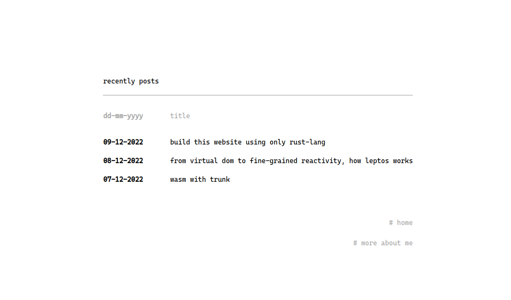
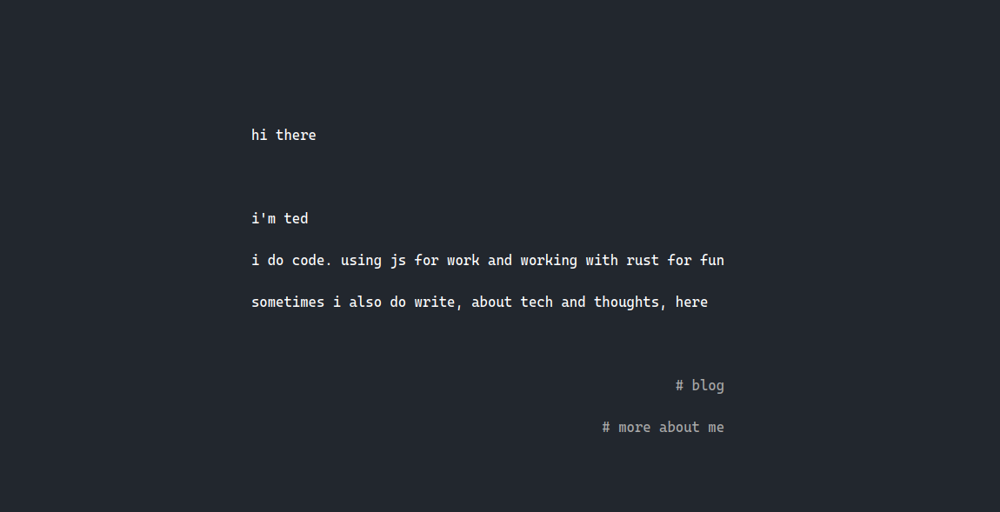

hello there

this blog is built with [leptos](https://github.com/gbj/leptos), using only rust, zero js code

that's that :crab-pls:

== how it look

-   light version
    

-   dark version
    

now, i stick with light version only, trying to make my life brighter lol

== how to build

```
cargo install trunk
trunk serve --open
```

== how to deploy

```
vercel --prod
```
